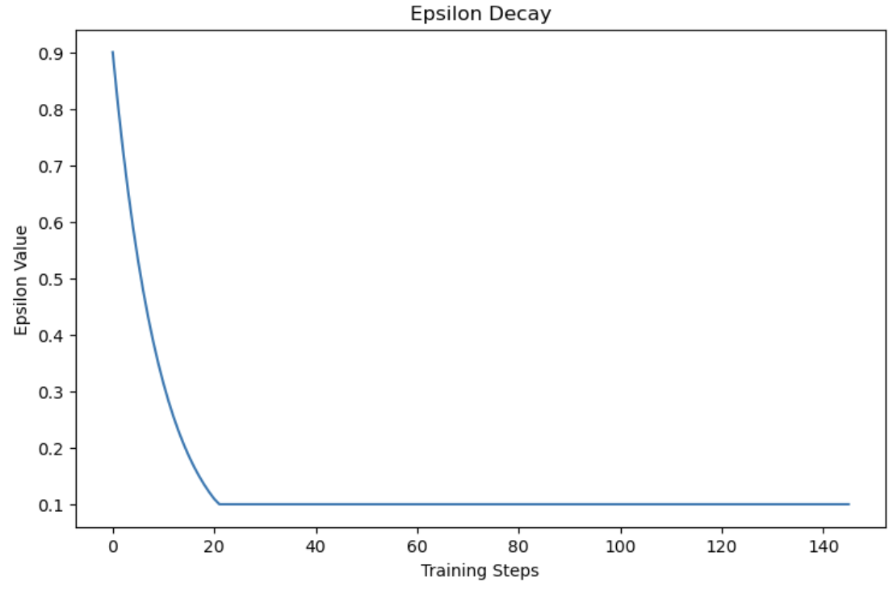

# Social Decision-Making and Helping Behavior: Can Q-Learning Models Learn to Help?

This repository contains the implementation and experiments for the project **"Social Decision-Making and Helping Behavior: Can Q-Learning Models Learn to Help?"**. The study builds upon the findings of Gureckis and Osborn Popp’s paper, exploring how Q-Learning and Deep Q-Learning can model altruistic behavior in a two-player game environment called the *Farm Task*.

This project is used as the final project for the class - Computational cognitive modeling (Fall 2024).  
Course Code: DS-GA 1016 (Data Science)/PSYCH-GA 3405.004 (Psychology)
Instructor: Todd Gureckis


## Overview

Helping behavior is central to human cooperation and social interactions. This project models helping gestures as sequential decision-making problems using reinforcement learning techniques. Specifically, it aims to:
1. Simulate helping behaviors using **Simple Tabular Q-Learning**, **Advanced Tabular Q-Learning**, and **Deep Q-Learning**.
2. Understand the influence of factors like **reciprocity**, **cost**, **resource capacity**, and **visibility** on decision-making.
3. Compare model predictions against empirical human behavior data.


## Methodology

### The Farm Task
The *Farm Task* is a two-player game designed to study helping behaviors in dynamic social settings. Players control avatars—the "Red Farmer" and the "Purple Farmer"—who collect and deliver same-colored vegetables on a grid to maximize their personal scores. Helping actions, where one player collects vegetables for the other, emerge naturally depending on:
- **Energy Costs**: Movement depletes energy, influencing the willingness to help.
- **Backpack Capacity**: Storage limitations impact decisions about whose vegetables to prioritize.
- **Visibility**: Players may see only their scores and energy levels or those of both players.


### Simple Tabular Q-Learning
The **Simple Tabular Q-Learning** approach uses a single Q-table to represent the state-action values for both agents. Key details:
- **Training**:
  - Agents are trained for 1,000 episodes across randomized environments.
  - Conditions like resource distribution, energy costs, and visibility are randomized per episode.
- **Reward Function**:
```
reward = Σ (state.reward(current_player)) for i = 1 to n
```

  Rewards are cumulative across an episode but sparsely provided, only at terminal states.
- **Policy**:
  - Uses an Epsilon-greedy policy: ε = 0.1,  strategy to balance exploration and exploitation.

Run Simple Tabular Q-Learning:
```bash
python simple_tabular_q/QL_v4.ipynb
```

### Advanced Tabular Q-Learning

The **Advanced Tabular Q-Learning** approach improves upon the simple version with richer state representations and separate Q-tables for each agent. Key details:
- **Two Q-Tables:**
	- Each agent maintains its Q-table, enabling personalized decision-making.

- **Reward Function:**
```math
r = farm.reward(current_player) + score - (distance_discount × step_cost)
```

- Factors in the distance to vegetables and the energy cost for movement.
- Step cost varies based on energy usage (low: 1, high: 2).

- **State Representation:**
	- Includes energy levels, scores, backpack capacities, visibility, and helping status (redHelped, purpleHelped).

- **Training:**
	- 1,000 episodes with 12 randomized games per episode.
	- Different resource, cost, and visibility conditions simulated.

- **Advantages:**
	- Captures interactions between agents and reflects more realistic decision-making.

Run Advanced Tabular Q-Learning:
```bash
python advanced_tabular_q/trainAgent.py
```


### Deep Q-Learning (DQN)

Deep Q-Learning (DQN) is an advanced reinforcement learning algorithm that extends traditional Q-Learning by using deep neural networks to approximate the Q-value function, enabling it to handle high-dimensional state and action spaces efficiently. This makes DQN particularly suitable for modeling decision-making in complex environments like the *Farm Task*.

#### Key Features:
1. **Two-Network Architecture**:
   - **Q-Network**: This neural network computes the Q-values for the agent's actions given the current state.
   - **Opponent Network**: A second network that predicts the opponent’s policy (i.e., the probability distribution over possible actions), allowing the agent to anticipate the opponent's actions and adjust its strategy accordingly.

2. **Modified Bellman Equation**:
   - The Q-value update rule is modified to consider both the agent’s own actions and the expected actions of the opponent:
```
Q(s, a) ← Q(s, a) + α * (r + γ * E_{sa} [ max_{a'} Q(s', a') ] - Q(s, a))
```
   - This modified equation helps in learning more effective policies by considering the interactions between agents.

3. **Training Process**:
   - The training is done on-line using the **Adam optimizer** with experience replay. Experience replay stores previous experiences (state-action-reward-next state tuples) and samples them to train the networks. This process helps stabilize learning and improve the generalization of the Q-values.
   - **Target Network Updates**: A frozen copy of the Q-Network is periodically updated to provide stable Q-value estimates.

4. **Number of Games Trained**:
   - The agent was trained over 8000 games in total. During training, the agent learned to balance between exploiting known strategies (maximizing individual rewards) and exploring new strategies (cooperative helping behaviors).
   - Each game involves the agent interacting with the environment, updating its Q-values, and refining its policy based on the modified Bellman equation.

5. **Exploration vs. Exploitation**:
   - The agent starts by exploring the environment randomly (high exploration) and gradually shifts to exploitation (greedy behavior) by decreasing the epsilon parameter over time. Initially, ε = 1 (complete exploration) and it is reduced by 1% every 1,000 actions during training, ensuring a balance between exploration and exploitation.



7. **Experience Replay**:
   - Both the Q-Network and the Opponent Network use experience replay to sample transitions from previous games. This technique reduces the correlation between consecutive experiences and stabilizes training.

#### Example Training Command:

To train the Deep Q-Learning model, run the following command:

```bash
python Deep Q-Network/main.py
```


## Results

#### Simple Tabular Q-Learning
- The agent demonstrates basic helping behaviors, but the sparseness of rewards limits the development of more complex, cooperative strategies.
- This method is effective for modeling simple, single-agent decision-making, but it struggles to capture interactions between multiple agents.

#### Advanced Tabular Q-Learning
- The use of personalized Q-tables and richer state representations leads to improved learning dynamics and more nuanced helping behaviors.
- While some cooperative actions are observed, the results show limited evidence of sustained cooperation, suggesting that refining the reward structure could better incentivize helping behavior.

#### Deep Q-Learning
- Deep Q-Learning shows the agent's ability to adapt its strategies over time, with occasional instances of helping behavior emerging.
- However, computational constraints hinder the full exploration of cooperative dynamics, meaning that further training and resources are needed to fully develop cooperative strategies.
## Project Structure

```bash
.
├── simple_tabular_q/                  # Simple Q-learning implementations
├── advanced_tabular_q/                # Tabular Q-learning implementations
├── Deep Q-Network /                   # Deep Q-learning implementations
├── model_fitting/                   
│   ├── data/                          # Data
│   └── model_fitting.ipynb            # Code to run model fitting
└── README.md                          # Project documentation

```
## References

Osborn Popp, P. J., & Gureckis, T. M. (2024). Moment-to-moment decisions of when and how to help another person. Proceedings of the Cognitive Science Society.
## Authors

- [@sophiejuco](https://github.com/sophiejuco)
- [@irishyl](https://github.com/irishyl)
- [@naman-ai](https://github.com/naman-ai)
- [@utkarsh231](https://github.com/utkarsh231)

